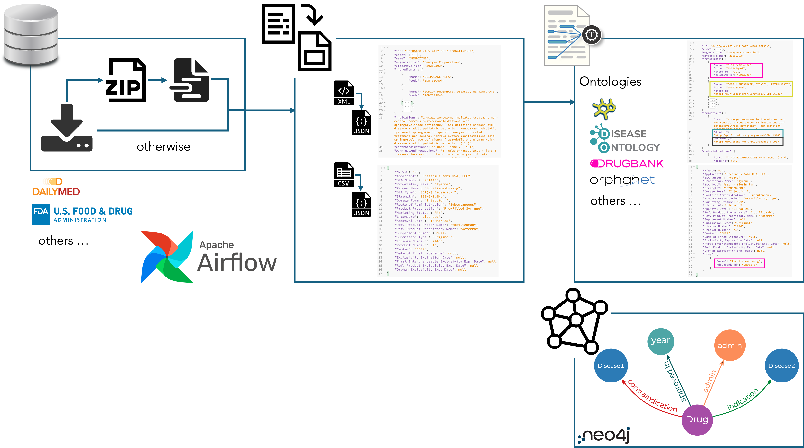

<div id="top"></div>
<!-- PROJECT SHIELDS -->
<!--
*** I'm using markdown "reference style" links for readability.
*** Reference links are enclosed in brackets [ ] instead of parentheses ( ).
*** See the bottom of this document for the declaration of the reference variables
*** for contributors-url, forks-url, etc. This is an optional, concise syntax you may use.
*** https://www.markdownguide.org/basic-syntax/#reference-style-links
-->


<!-- PROJECT LOGO -->
<br />
<div style="display: flex; align-items: center;">
    <div style="flex: 1;">
        <a href="https://isel.pt" target="_blank">
            
        </a>
    </div>
    <div style="flex: 3; text-align: left; padding-left: 20px;">
        <h3>BIOMEDICAL-ANALYSIS</h3>
    </div>
</div>

[](https://www.python.org/)
[](https://www.docker.com/)
[](https://airflow.apache.org)

## BIOMEDICAL-ANALYSIS

A pipeline for converting various drug file formats to JSON and uploading critical data to a Neo4j database.



1. [Project Structure](#project-structure)
2. [Usage](#usage)

## Project Structure

```
medjsonify/
├── img/
├── airflow/
├── database/
├── upload/
├── NER/
├── jsonify/
├── Dockerfile
├── README.md
├── docker-compose.yml
├── docker.sh
└── requirements.txt
```

The project consists of four primary directories:
- `airflow`: Contains Apache Airflow configuration and DAG files.
- `database`: Houses Neo4j connection files and knowledge graph implementation.
- `upload`: Includes Python scripts for extracting and processing target files.
- `NER`: Contains Named Entity Recognition models and scripts for extracting information from medical texts.
- `jsonify`: Features the converter package for transforming various file formats to JSON.

Each directory contains a README file with detailed information about the respective module.

The `Dockerfile` and `docker-compose.yml` files facilitate Docker container building and execution. The `docker.sh` script automates this process.

The `requirements.txt` file lists all dependencies required to run the project.

## Usage

1. Clone the repository:
```bash
git clone medjsonify
```

2. Navigate to the root directory:
```bash
cd medjsonify
```

3. Grant execution permissions to the Docker script:
```bash
chmod +x docker.sh
```

4. Build and run the Docker container:
```bash
./docker.sh
```

5. Access the Apache Airflow interface:
```bash
http://localhost:8080
```

6. Execute the DAG through the Airflow interface.

## License

This project is licensed under the MIT License - see the LICENSE file for details.

## How to cite
