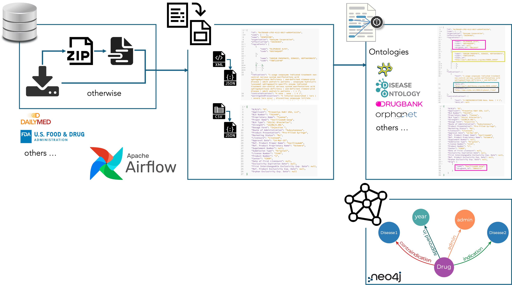

<div id="top"></div>

<!-- PROJECT LOGO -->
<br />
<div style="display: flex; align-items: center;">
    <div style="flex: 1;">
        <a href="https://isel.pt" target="_blank">
            
        </a>
    </div>
    <div style="flex: 3; text-align: left; padding-left: 20px;">
        <h3>MedJsonify</h3>
    </div>
</div>

<!-- PROJECT SHIELDS -->
<!--
*** I'm using markdown "reference style" links for readability.
*** Reference links are enclosed in brackets [ ] instead of parentheses ( ).
*** See the bottom of this document for the declaration of the reference variables
*** for contributors-url, forks-url, etc. This is an optional, concise syntax you may use.
*** https://www.markdownguide.org/basic-syntax/#reference-style-links
-->

[](https://www.python.org/)
[](https://www.docker.com/)
[](https://airflow.apache.org)
[](https://neo4j.com/)
[](https://www.nltk.org)
[](https://pandas.pydata.org)
[](https://shields.io/)

## Overview

MedJsonify is a comprehensive biomedical data processing pipeline that extracts, transforms, and analyzes pharmaceutical information from various data sources. The framework converts multiple input formats (XML, CSV, TXT) into standardized JSON, performs Named Entity Recognition (NER) to extract biomedical entities, and builds a knowledge graph in Neo4j to represent relationships between drugs, diseases, and other medical concepts.

<div align="center">
  
</div>

## Table of Contents

1. [Project Structure](#project-structure)
2. [Key Features](#key-features)
3. [Technologies](#technologies)
4. [Data Sources & Ontologies](#data-sources--ontologies)
5. [Installation & Setup](#installation--setup)
6. [Usage Guide](#usage-guide)
7. [Pipeline Workflow](#pipeline-workflow)
8. [Troubleshooting](#troubleshooting)
9. [License](#license)
10. [How to Cite](#how-to-cite)

## Project Structure

The project is organized into several key modules, each responsible for specific aspects of the data processing pipeline:

```
medjsonify/
├── img/                          # Images and documentation resources
├── airflow/                      # Apache Airflow configuration and DAG files
│   ├── dags/                     # DAG definition files
│   │   ├── utils/                # Utility functions for DAGs
│   │   │   ├── config.py
│   │   │   └── tasks.py  
│   │   ├── airflow.ini          # Airflow configuration
│   │   ├── converter_dag.py     # DAG for file conversion process
│   │   ├── create_user.py       # Script to create Airflow users
│   │   ├── jsonify_dag.py       # Complete data processing pipeline DAG
│   │   ├── neo4j_dag.py         # DAG for Neo4j database operations
│   │   └── ner_dag.py           # DAG for Named Entity Recognition
│   
├── database/                    # Neo4j database integration
│   ├── knowledge_graph.py       # Knowledge graph implementation
│   ├── neo4j.ini                # Neo4j connection configuration
│   └── queries.md               # Example Neo4j queries
│   
├── upload/                      # Data acquisition and preprocessing
│   ├── download_from_url.py     # Download files from URLs
│   ├── extract_files.py         # Extract files from archives
│   ├── unzip_directories.py     # Extract ZIP archives
│   └── upload_loader.py         # Configuration for upload process
│   
├── NER/                          # Named Entity Recognition processing
│   ├── __init__.py
│   ├── standalone_bioner.py           # Main standalone BioNER class
│   ├── ner_entities.py                # Core entity processing logic
│   ├── ner_entities_batch.py          # Batch processing for multiple files
│   ├── ner_drugbank.py                # DrugBank vocabulary matching
│   ├── Biomedical_preprocessing.py    # Text preprocessing utilities
│   ├── download_vocabulary.py         # Vocabulary download utilities
│   ├── setup.py                       # Setup and validation script
│   ├── logging_config.py
│   ├── validators.py 
│   ├── metrics.py
│   ├── bioner.ini                     # Main configuration file
│   │   
│   ├── ontologies/                        # Ontology management
│   │   ├── data/                          # Processed ontology data files
│   │   └── scripts/                       # Shell scripts for ontology processing
│   ├── data/                              # Data files and outputs
│   │    ├── blacklists/                    # Entity blacklists
│   │    ├── entities/                      # Final NER output (by source type)
│   │    └── preprocessing/                 # Intermediate preprocessing results
│   └── tests/                              
│    
├── jsonify/                      # File format conversion module
│   └── src/                      # Conversion source code
│       └── conversion.py         # Main conversion driver
│   
├── .env 
├── Dockerfile                   # Docker container definition
├── docker-compose.yml           # Docker Compose configuration
├── docker.sh                    # Script to build and run containers
├── setup.sh                     # Automated setup script to create all missing files
└── requirements.txt             # Python dependencies
```

## Key Features

- **Multi-format Data Processing**: Converts XML, CSV, and TXT files to standardized JSON format
- **Named Entity Recognition (NER)**: Extracts biomedical entities like drugs, diseases, and chemical compounds
- **Knowledge Graph Construction**: Creates a structured graph in Neo4j representing relationships between entities
- **Workflow Orchestration**: Uses Apache Airflow to manage and schedule the complete data pipeline
- **Containerized Deployment**: Packaged with Docker for easy deployment and environment consistency
- **Ontology Integration**: Leverages biomedical ontologies like ChEBI, Disease Ontology, and Orphanet

## Technologies

- **Apache Airflow**: Workflow orchestration and scheduling
- **Docker**: Containerization for deployment
- **jsonifyer** Tool that convert data into the structured, human-readable JSON (JavaScript Object Notation)
- **lxml**: XML processing and XSLT transformations
- **Neo4j**: Graph database for knowledge representation
- **NLTK**: Natural Language Processing for text preprocessing
- **Pandas**: Data manipulation and transformation
- **Python**: Core programming language

## Data Sources and Ontologies

- DailyMed: FDA-approved drug labeling (time-based URLs)
- Purple Book: FDA-licensed biological products (time-based URLs)
- Orange Book: FDA-approved drug products (direct download)

### Supported Ontologies

| Ontology | Acronym | Purpose | Example Entities |
|----------|---------|---------|------------------|
| Disease Ontology | DOID | Human diseases | diabetes, asthma, cancer |
| ChEBI | CHEBI | Chemical entities | glucose, insulin, aspirin |
| Human Phenotype | HPO | Phenotypic features | fever, seizure, tremor |
| Orphanet | ORDO | Rare diseases | Niemann-Pick, Gaucher |


## Installation

### Prerequisites

- Docker and Docker Compose
- Git

### Setup

1. Clone the repository:
```bash
git clone https://github.com/your-username/MedJsonify.git
```

2. Navigate to the project directory:
```bash
cd MedJsonify
```

3. Grant execution permissions to the Docker script:
```bash
chmod +x docker.sh
```

4. Airflow Configuration:
the file is located at /dags/airflow.cfg. 
```ini
[USER]
username = admin
firstname = Admin
lastname = User
role = Admin
email = admin@example.com
password = admin
```

5. Vocabulary and Ontology Configuration:
The system relies on external biomedical vocabularies and ontologies. These must be correctly configured before execution
(the file is located at /NER/bioner.ini). 

   5.1. **Vocabulary** Sources:
   The following URLs define the external vocabularies that are downloaded and processed by the system:
   ```ini
   [VOCABULARY]
   drugbank_url = https://go.drugbank.com/releases/5-1-13/downloads/all-drugbank-vocabulary
   ```
   Users may replace these URLs with alternative versions or mirrors if required, provided the formats remain compatible.

   5.2. **Ontology Processing** Configuration:
   Ontology usage and update behavior are controlled via the following section
   ```ini
   [ONTO]
   active_lexicons: doid, chebi, hp, ordo
   # Update ontologies (yes: 1 | no: 0)
   update: 1
   ```
   In ```active_lexicons``` you will define which ontologies are enabled for processing. Only the listed ontologies 
   will be loaded and used by the system. In ```update``` the user can control whether ontologies are re-downloaded and 
   rebuilt at startup (1- Force update (download and rebuild ontologies) and 0 – Use existing local versions (recommended 
   for reproducibility)).

   5.3. **Ontology URL update** Configuration:
   ```ini
   [ONTOLOGIES]
   # Orphanet Rare Disease Ontology (ORDO)
   ordo_url = https://www.orphadata.com/data/ontologies/ordo/last_version/ORDO_en_4.8.owl
   ordo_name = ordo
   ordo_description = Orphanet Rare Disease Ontology
   ```
   Ontology URLs should be configured to use the most current versions available. The Open Biological and Biomedical Ontology (OBO) 
   Foundry provides stable, version-agnostic URLs that automatically resolve to the latest releases. These URLs automatically resolve 
   to the latest stable release and, the system handles versioning automatically, ensuring you always work with current data. Use 
   ``chebi_lite.owl`` for better performance; the full ChEBI ontology is significantly larger.
   For ontologies not hosted on OBO Foundry (like the detailed ORDO with full metadata), you may need to specify versioned URLs.
   However, when available, prefer the OBO Foundry URLs for consistency and automatic updates.

## Usage Guide

1. Build and run the Docker containers:
```bash
./docker.sh
```

2. Access the Apache Airflow web interface:
```bash
http://localhost:8080
```

3. Log in with the default credentials:
   - Username: admin
   - Password: admin

4. From the Airflow UI, activate and trigger the desired DAG:
   - `converter_dag`: Only converts files to JSON
   - `ner_dag`: Processes JSON files with NER
   - `medjsonify_dag`: Runs the complete pipeline

5. After processing, the Neo4j database will contain the knowledge graph. Access the Neo4j browser:
```bash
http://localhost:7474
```

## Pipeline Workflow

The complete data processing pipeline consists of the following steps:

1. **Data Acquisition**:
   - Download files from configured URLs (Note: files from last month. If you want too change go to: download_from_url.py)
   - Extract ZIP archives
   - Extract specific files based on type

2. **Data Conversion**:
   - Convert XML files using either Python-based parsing or XSLT
   - Convert CSV files with appropriate delimiters and headers
   - Convert TXT files with specified delimiters
   - Standardize to JSON format

3. **Named Entity Recognition**:
   - Download and update biomedical vocabularies and ontologies
   - Preprocess JSON text fields for NER
   - Extract drug and disease entities
   - Normalize entity identifiers to standard ontologies

4. **Knowledge Graph Construction**:
   - Create nodes for drugs, diseases, administration routes, and approval years
   - Establish relationships between entities (TREATS, CONTRAINDICATED_FOR, etc.)
   - Apply constraints to ensure data integrity

## Troubleshooting

### Common Issues

#### 1. Ontology Processing Fails

**Symptom**: `ERROR: Missing script: process_ontology.sh`

**Solution**:
```bash
# Make scripts executable
chmod +x NER/ontologies/scripts/*.sh

# Or in Docker
docker-compose exec airflow chmod +x /opt/airflow/dags/NER/ontologies/scripts/*.sh
```

#### 2. Entity Extraction Returns Empty

**Symptom**: `No entities found` for known terms

**Diagnosis**:
```bash
# Check if lexicon files exist
ls -lh NER/ontologies/data/doid_*.txt

# Verify first few entries
head NER/ontologies/data/doid_word1.txt

# Test extraction manually
./NER/ontologies/scripts/extract_entities.sh "diabetes" doid ./NER/ontologies/data
```

**Solutions**:
- Reprocess ontology: `ner.update_ontology('doid')`
- Check text preprocessing isn't over-aggressive
- Verify lexicon name matches (e.g., 'doid' not 'do')

#### 3. DrugBank Matching Fails

**Symptom**: No `drugbank_id` in output

**Diagnosis**:
```python
from NER.ner_drugbank import load_drugbank_data, create_vocabulary

drugbank = load_drugbank_data('data/drugbank_vocabulary.csv')
vocab = create_vocabulary(drugbank)

print(f"Loaded {len(vocab)} drug names")
print(f"Sample: {list(vocab)[:10]}")
```

**Solutions**:
- Re-download DrugBank: Run `download_vocabulary_task()`
- Lower similarity threshold: `get_drug_info(query, drugbank, vocab, thresh=0.75)`
- Check drug name normalization

#### 4. Neo4j Connection Refused

**Symptom**: `ServiceUnavailable: Unable to retrieve routing information`

**Solution**:
```bash
# Check Neo4j status
docker-compose ps neo4j

# Restart Neo4j
docker-compose restart neo4j

# Check logs
docker-compose logs neo4j

# Verify connection
docker-compose exec airflow python -c "
from neo4j import GraphDatabase
driver = GraphDatabase.driver('bolt://neo4j:7687', auth=('neo4j', 'testpassword'))
driver.verify_connectivity()
print('Connected!')
"
```

#### 5. Airflow Tasks Fail with Import Error

**Symptom**: `ModuleNotFoundError: No module named 'NER'`

**Solution**:
```bash
# Check PYTHONPATH in docker-compose.yml
# Should include: PYTHONPATH: "/opt/airflow/dags:/opt/airflow/dags/jsonify/src"

# Restart container
docker-compose restart airflow

# Or add to task:
import sys
sys.path.insert(0, '/opt/airflow/dags/NER')
```

### Performance Optimization

#### Slow NER Processing

**Optimize ontology files**:
```bash
# Remove very common/generic terms from lexicons
grep -v "^the\|^a\|^an" doid_word1.txt > doid_word1_filtered.txt

# Limit to high-confidence matches
# Edit extract_entities.sh: MIN_WORD_LENGTH=4
```

**Increase parallelism**:
```python
# In ner_entities_batch.py
with ThreadPoolExecutor(max_workers=8) as executor:  # Default: 4
    executor.map(process_file_in_batch, files_to_process)
```

#### Memory Issues

**Reduce batch size**:
```ini
# In bioner.ini
[SAMPLE]
splitedSize = 500  # Default: 1000
```

**Process fewer ontologies**:
```ini
[ONTO]
active_lexicons = doid, chebi  # Remove hp, ordo if not needed
```

### Debugging Tips

1. **Check Logs**:
   ```bash
   # Airflow task logs
   docker-compose logs airflow | grep ERROR
   
   # View specific task log in Airflow UI
   # DAG → Task → Log
   ```

2. **Test Components Individually**:
   ```bash
   # Test ontology processing
   ./NER/ontologies/scripts/process_ontology.sh test.owl ./data
   
   # Test entity extraction
   ./NER/ontologies/scripts/extract_entities.sh "test text" doid ./data
   
   # Test preprocessing
   python -c "
   from NER.Biomedical_preprocessing import BiomedicalPreprocessor
   p = BiomedicalPreprocessor()
   print(p.preprocess_text('Test with DM and HTN'))
   "
   ```

3. **Enable Debug Mode**:
   ```bash
   # For shell scripts
   export DEBUG=1
   ./extract_entities.sh "diabetes" doid ./data
   
   # For Python
   import logging
   logging.basicConfig(level=logging.DEBUG)
   ```

---

## Appendix

### Ontology URLs Reference

| Ontology | URL | Size | Entities |
|----------|-----|------|----------|
| DOID | http://purl.obolibrary.org/obo/doid.owl | ~40MB | ~10,000 |
| ChEBI | http://purl.obolibrary.org/obo/chebi/chebi_lite.owl | ~200MB | ~100,000 |
| HPO | http://purl.obolibrary.org/obo/hp.owl | ~50MB | ~16,000 |
| ORDO | https://www.orphadata.com/data/ontologies/ordo/last_version/ORDO_en_4.8.owl | ~100MB | ~9,000 |

### Shell Script Parameters

#### `process_ontology.sh`

```bash
Usage: ./process_ontology.sh <ontology_file> [output_dir]

Examples:
  ./process_ontology.sh doid.owl data/
  ./process_ontology.sh chebi.owl data/
```

**Configuration Variables**:
- `MIN_ENTITY_SIZE_ALPHA=3`: Minimum alphabetic characters
- `MAX_ENTITY_SIZE_DIGIT=5`: Maximum consecutive digits
- `REMOVE_OBSOLETE=1`: Remove obsolete concepts

#### `extract_entities.sh`

```bash
Usage: ./extract_entities.sh [--no-uri] <text> <lexicon_name> [data_dir]

Options:
  --no-uri, -u, -U    Output only START, END, and ENTITY (no URI)

Examples:
  ./extract_entities.sh 'diabetes mellitus' doid data/
  ./extract_entities.sh --no-uri 'aspirin' chebi data/
  DEBUG=1 ./extract_entities.sh 'test' doid data/  # Debug mode
```

**Configuration Variables**:
- `USE_STOPWORDS=1`: Enable stopword filtering
- `MIN_WORD_LENGTH=3`: Minimum word length to match
- `DEBUG=0`: Debug output (set to 1 for verbose logging)


## License

This project is licensed under the MIT License - see the LICENSE file for details.

## How to Cite

If you use MedJsonify in your research, please cite it as follows:

```
@conference{Pereira2025,
    author = Ana Carolina Pereira, Matilde Pato and Nuno Datia,
    booktitle = 12th ACM Celebration of Women in Computing: womENcourage™ 2025,
    title = Knowledge Graphs as Educational Tools in Biomedical Education,
    year = 2025
}
```

---

<div align="center">
  <p>Developed by Carolina Pereira as part of the Workflow System for Data Integration's Project.</p>
</div>

---

*Last Updated: January 3, 2026*